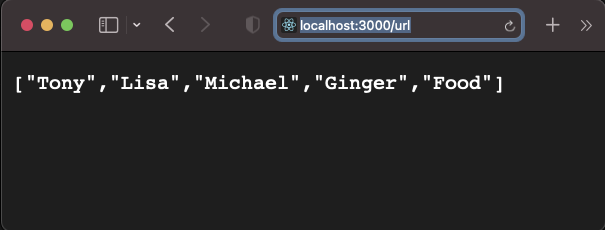

# nodejs sederhana dengan framework expressjs.

---

instalasi expressjs:

	❯ npm install express

periksa file json dan buat file js secara manual serta isinya.

- package.json

- app.js

jalankan (command) :

	❯ node app.js

	    op:
	    Server running on port 3000

---

    

Tampilan pada browser

---
